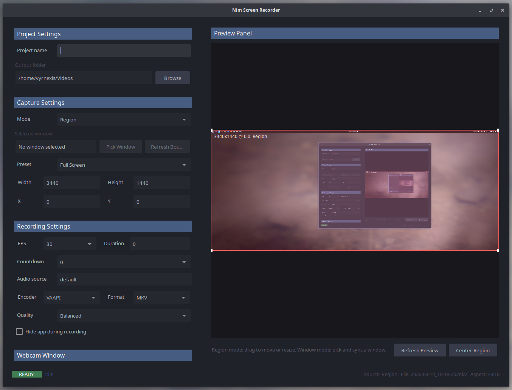

# Nim Screen Recorder

Linux desktop screen recorder for X11 written in Nim with NiGui and FFmpeg.

It provides a desktop preview inside the main window, region and window capture modes, optional webcam-window support, and an FFmpeg-based recording backend.

## Screenshot



## Features

- Desktop preview panel with a draggable and resizable capture rectangle
- Project settings for project name and output folder
- Capture settings for region or window mode, presets, width, height, X, Y, selected window, and aspect-ratio feedback
- Recording settings for FPS, duration, countdown, audio source, encoder, output format, quality, and optional auto-hide
- Global start/stop hotkey: `Ctrl+Alt+R`
- Global pause/resume hotkey: `Ctrl+Alt+P`
- Optional webcam window driven by `ffplay`
- FFmpeg subprocess backend for X11 screen capture
- Clean recorder shutdown so recordings finalize correctly
- Pause/resume support for active recordings without keeping a frozen paused section
- Idle, recording, and paused application icons for clearer taskbar feedback
- Desktop notifications for start, pause, resume, stop, and failure while the app is minimized
- Per-recording FFmpeg log files when a recording fails unexpectedly

## Requirements

- Nim 2.2+
- NiGui
- FFmpeg
- FFplay
- xdotool
- Linux desktop session
- X11 display

## Build

Run directly with Nim:

```bash
nim c -r src/NimScreenRecorder.nim
```

Release build:

```bash
nim c -d:release -r src/NimScreenRecorder.nim
```

Nimble tasks:

```bash
nimble Debug
nimble Release
```

Both Nimble tasks place the binary in `./bin`.

## Install

For a compiled release tree, install the app user-local with:

```bash
./install-user.sh
```

That installs:

- the binary into `~/.local/bin`
- the desktop launcher into `~/.local/share/applications`
- the icons into `~/.local/share/icons/hicolor`

Run the install script again after icon or desktop-file changes so the launcher metadata is refreshed.

Remove the user-local install with:

```bash
./uninstall-user.sh
```

## How To Use

1. Start the app.
2. Set a project name if you want named output files.
3. Choose or browse to an output folder.
4. Choose a capture mode:
   - `Region`: use the preview panel or the X/Y/Width/Height fields.
   - `Window`: click `Pick`, then click the X11 window you want to record.
5. Choose recording settings:
   - FPS
   - duration
   - countdown
   - audio source
   - encoder
   - format
   - quality
6. If you want the webcam visible in the recording, stay in `Region` mode and enable `Show webcam window`.
7. Start recording with the button or `Ctrl+Alt+R`.
8. Pause or resume with the `Pause Recording` button or `Ctrl+Alt+P`.
9. Stop recording with the button or `Ctrl+Alt+R`.

## Capture Modes

`Region`

- The preview panel is editable.
- You can drag and resize the capture rectangle.
- Webcam window support is available.

`Window`

- The selected X11 window is recorded directly with `-window_id`.
- Preview editing is locked to the selected window bounds.
- Window bounds are refreshed automatically before recording starts.
- Use `Refresh Bounds` if the target window moves or resizes before recording.
- Webcam window support is disabled in this mode because the webcam is a separate window.

## Encoders

`libx264`

- software encoder
- best compatibility
- higher CPU usage

`VAAPI`

- hardware encoder for supported Linux GPU stacks
- lower CPU usage
- often better for high-resolution or high-FPS recording

`NVENC`

- hardware encoder for NVIDIA GPUs
- only shown when supported by both FFmpeg and local hardware

## Webcam Window

The webcam is not composited into FFmpeg.

When `Show webcam window` is enabled:

- the app launches a separate webcam window with `ffplay`
- the webcam can be mirrored
- you place that window inside the recording area
- the desktop recording captures it like any other window

This keeps recording smoother than live FFmpeg webcam compositing.

## Project Structure

- `src/NimScreenRecorder.nim`: binary entrypoint
- `src/ui.nim`: window layout and UI bindings
- `src/state.nim`: recorder state, presets, validation, and environment detection
- `src/preview.nim`: desktop preview widget and region selection logic
- `src/ffmpeg.nim`: FFmpeg argument generation for screen recording
- `src/recorder.nim`: FFmpeg recording subprocess lifecycle
- `src/restorefix.nim`: Linux/X11 window restore workaround for global-hotkey stop
- `src/windowpicker.nim`: X11 window selection and geometry lookup via `xdotool`
- `src/webcam.nim`: webcam device detection and `ffplay` window lifecycle

## Notes

- Preview refreshes by capturing desktop screenshots with FFmpeg.
- Default output directory is `~/Videos/<Project Name>`.
- If the project name is blank, the output file name falls back to a timestamp.
- Output folder paths are normalized before recording.
- Encoder choices are limited to what the local FFmpeg build and hardware can actually use.
- Recording format can be switched between `MP4` and `MKV`.
- The default output format is `MKV` because it is safer if a recording stops unexpectedly.
- Quality presets map to simple defaults for the selected encoder: `Fast`, `Balanced`, and `High`.
- `Hide app window while recording` minimizes the app and restores it again when recording stops.
- Pausing closes the current recording segment and resuming starts a new one.
- The final output is assembled from those segments, so paused time is skipped instead of appearing as a frozen section.
- The window icon changes between idle, recording, and paused states when the desktop honors runtime icon updates.
- When `Hide app window while recording` is enabled, desktop notifications provide state feedback even if the taskbar icon does not change live.
- If FFmpeg exits unexpectedly, the app shows the failure and stores a `.ffmpeg.log` file next to the intended output file.
